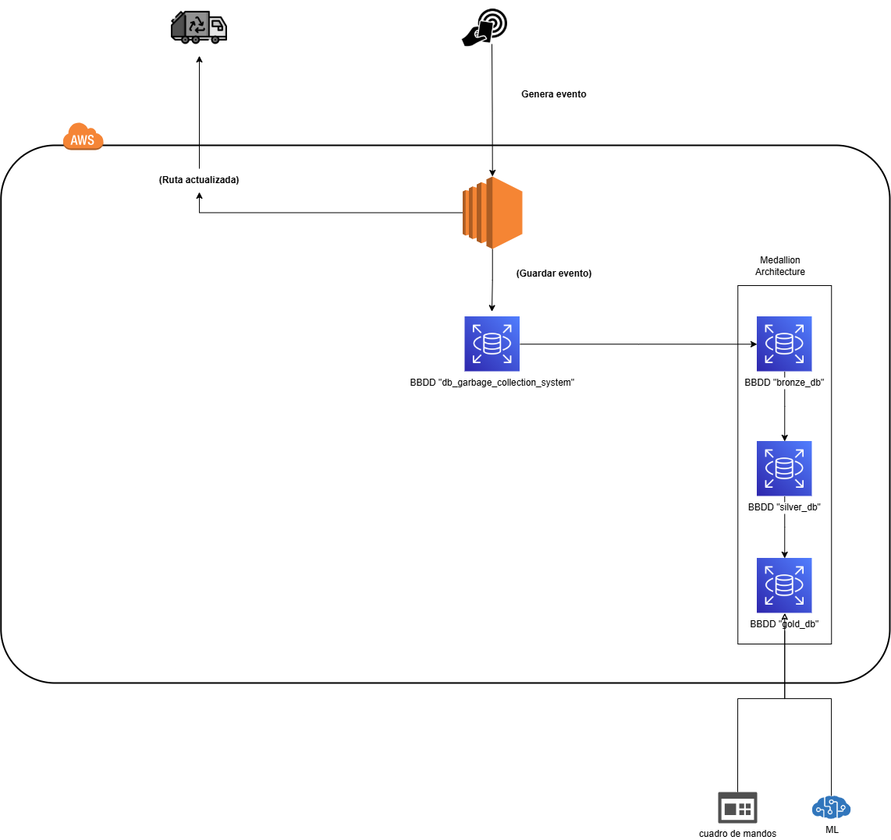
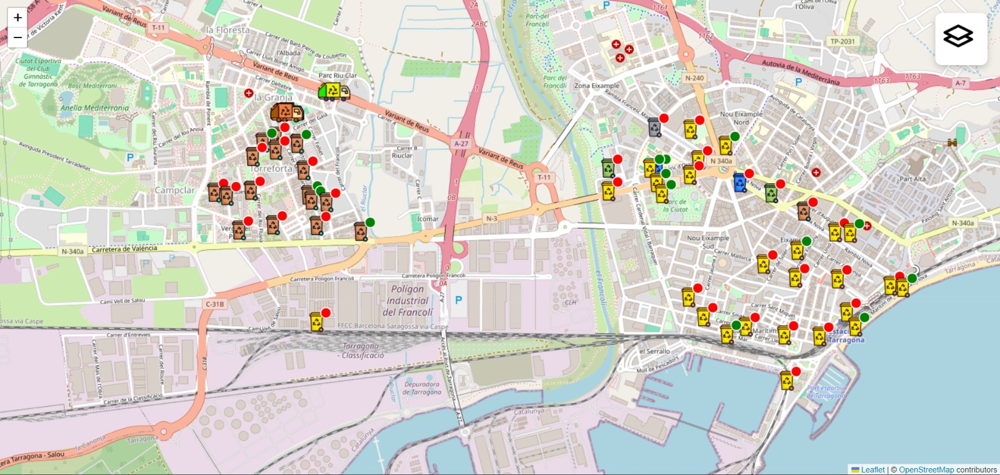
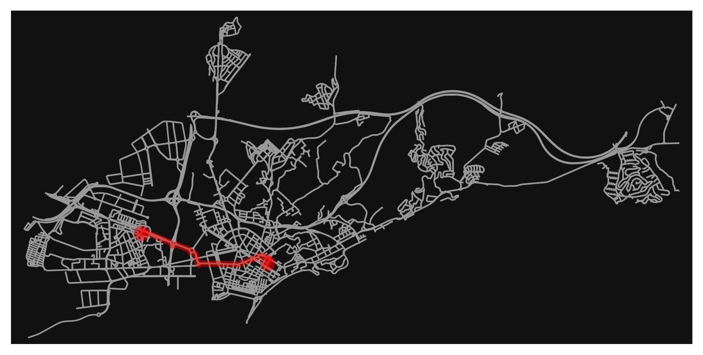

# 📌 EcoRuta

EcoRuta 360 és un prototip innovador que optimitza les rutes dels camions de recollida de residus urbans. El nostre sistema recull dades en temps real de la interacció amb els contenidors de la ciutat (gràcies al nou sistema de targeta de residus), analitza informació històrica i permet empra tècniques de machine learning per predir els dies de màxim afluència, per una millor presa de decisions. D'aquesta manera, es poden generar rutes òptimes per als camions, millorant la gestió dels residus, la productivitat operativa i, alhora, la salut i qualitat de vida de la ciutadania.

## 👥 Equip

### **Elyas Elkouissi**

### **Marcel Povill** 

### **Massin Laaouaj**

## ❓ Problema abordat

Amb el creixement urbà, la gestió de residus es converteix en un repte cada vegada més crític.  

Els problemes més comuns inclouen:
- **Rutes ineficients** dels camions de recollida, que generen costos addicionals i retards.
- **Dades en temps real insuficients** per a prendre decisions informades en situacions de pics de demanda (festes locals, temporada turística alta, festius, etc.).
- **Impacte negatiu en la salut** de la ciutadania a causa de mals olors i la proliferació de plagues.
- **Gestió inadequada dels pics d'activitat**, on els recursos es veuen saturats.

## 💡 La nostra solució

EcoRuta aborda aquests problemes mitjançant un sistema intel·ligent que:
- **Recull dades en temps real**: Cada vegada que un ciutadà obre la compuerta d'un contenidor, el sistema actualitza i registra l'estat en una base de dades.
- **Processa informació històrica**: Les dades recollides es transformen i emmagatzemen en una arquitectura de capes (bronze, silver i gold) per a anàlisis futures.
- **Optimitza les rutes**: Utilitzant algoritmes d'optimització i machine learning, el sistema analitza els pics de demanda i pot emprar rutes òptimes per als camions.
- **Millora la salut i qualitat de vida**: Mitjançant una recollida més eficient, es redueixen els mals olors i la proliferació de plagues, beneficiant la ciutadania.

## 🛠️ Tecnologies utilitzades

- **Llenguatges de programació:** SQL, Python, Javascript
- **Frameworks i llibreries:** scikit-learn, Pandas, numpy
- **Eines i plataformes:**  
  - AWS RDS per a la gestió de bases de dades
  - MySQL Event Scheduler per a automatitzar processos
  - GitHub per al control de versions

## ☁️ Sistema Implementat

El nostre sistema segueix una arquitectura en tindre una BBDD Aurora Serverless V2 la cual ens permet escalar segons la demanda de peticions, y guarda de forma persistent les dades de l'aplicatiu.

El sistema te una part analitica, la cual serveix pels rols que prenen decisions y els equips de dades que consumeixen d'aquest per realitzar estudis (EDA), o aplicant algorismes com de machine learning per tal de millorar el servei, i preveure amb les dades historiques, per tal de fer-ho possible hem implementat l'arquitectura Medallion:
- **Capa Bronze:** Ingesta de dades en temps real amb triggers i procedures per a registrar cada interacció amb els contenidors.
- **Capa Silver:** Processament i neteja de les dades, eliminant registres incomplets, e incoherents.
- **Capa Gold:** Creació de vistes i informes per a l'anàlisi avançat i la presa de decisions.

_A continuació, es mostra un diagrama del sistema:_

## 🌍 Impacte del projecte

EcoRuta pot beneficiar la ciutat de múltiples maneres:
- **Millora en la gestió dels residus:** Reducció de costos operatius i optimització dels recursos.
- **Salubritat urbana:** Menors problemes d'olor i proliferació de plagues, millorant la salut pública.
- **Dades per a la presa de decisions:** Informació en temps real i històrica que permet adaptar la logística a situacions de pic, com esdeveniments locals o temporades turístiques.
- **Innovació i sostenibilitat:** Promou un model de gestió intel·ligent aplicable a altres ciutats i entorns.

## 📸 Captures i/o demo del projecte

A continuació es poden veure algunes capturas i enllaços a demos:
[Demo en línia](https://github.com/exemple/demo)

## 🙌 Agraïments i conclusió

Agraïm sincerament el suport i les oportunitats proporcionades per la **Hackató Cloud Computing 2025**, la **Universitat Rovira i Virgili** i **T-Systems**. Esperem que EcoRuta inspiri noves solucions intel·ligents en la gestió urbana i contribueixi a un futur més net i eficaç.
